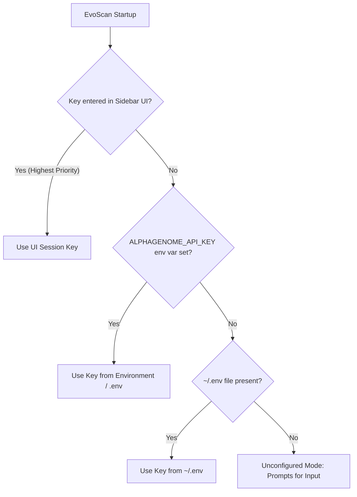

# Google DeepMind AlphaGenome Personal API Key Configuration Guide

> [!IMPORTANT]
> **Personal API Key Requirement:** To query **Google DeepMind AlphaGenome Atlas** cloud gRPC servers through **EvoScan**, each user must supply their own personal API key. EvoScan does not include shared or preconfigured keys in production.

---

## 1. How to Obtain Your Personal API Key

Access to the AlphaGenome Atlas API is provided free of charge by Google DeepMind for **academic and non-commercial scientific research (Research Use Only - RUO)**.

Follow these step-by-step instructions:

1. **Visit the Official API Portal:**  
   Navigate to: [**https://deepmind.google.com/science/alphagenome/api**](https://deepmind.google.com/science/alphagenome/api).
2. **Sign In with Your Google Account:**  
   Click **Sign In** using your academic, institutional, or personal Google account.
3. **Request API Access (Research Use Only):**  
   Fill out the application form specifying your research institution/organization and intended use case.
4. **Accept Terms of Service:**  
   Review the RUO license (the model and its predictions are intended for research only and must not be used as the sole basis for clinical diagnosis without orthogonal laboratory validation).
5. **Generate and Copy Your API Key:**  
   An alphanumeric key string will be generated (starting with `AIzaSy...`). Copy it and store it securely: never share it publicly or commit it to public Git repositories.

---

## 2. Configuration Methods in EvoScan

EvoScan supports three flexible methods to load your API key:



### Method A: Directly in the EvoScan Web Interface (Recommended)
1. Launch the web application:
   ```bash
   streamlit run app.py
   ```
2. In the left sidebar, select the engine:  
   `🧬 Google DeepMind AlphaGenome Atlas`.
3. Paste your key into the password field:  
   **"Personal DeepMind API Key"** (the key is masked with `••••••••`).
4. EvoScan verifies the key and displays the green badge: `🔑 API Key Active (Personal / Session)`.

---

### Method B: Local `.env` Configuration File (Persistent)
If you use EvoScan regularly on your local machine or server and prefer not to re-enter your key on every session:

1. Create or edit a `.env` file in the root project directory:
   ```bash
   # Path: EvoScan/.env
   ALPHAGENOME_API_KEY=AIzaSy_YOUR_PERSONAL_API_KEY_HERE
   ```
2. EvoScan will automatically detect and load the key on launch.

> [!NOTE]
> `.env` and `.env.*` are already included in `.gitignore` to prevent any accidental commit to Git.

---

### Method C: System Environment Variable (Scripts & CI/CD Pipelines)
If you run EvoScan inside Docker containers, automated workflows, or custom Python scripts:

- **Linux / macOS (Bash / Zsh):**
  ```bash
  export ALPHAGENOME_API_KEY="your_personal_api_key"
  streamlit run app.py
  ```

- **Windows (PowerShell):**
  ```powershell
  $env:ALPHAGENOME_API_KEY="your_personal_api_key"
  streamlit run app.py
  ```

- **Windows (Command Prompt CMD):**
  ```cmd
  set ALPHAGENOME_API_KEY=your_personal_api_key
  streamlit run app.py
  ```

---

## 3. Verifying gRPC Connectivity

You can verify that your API key is active and that DeepMind's gRPC endpoints respond properly by executing the automated test suite:

```bash
python -m pytest tests/test_alphagenome_engine.py
```

If the key is valid, the tests will pass:
```text
tests\test_alphagenome_engine.py ........ [100%]
============================= 8 passed in 3.12s ==============================
```

Or perform a rapid Python probe from your terminal:

```python
from evoscan.alphagenome_engine import AlphaGenomeEngine

engine = AlphaGenomeEngine(api_key="YOUR_KEY")
ok, msg = engine.validate_connection()
print(f"Connection Status: {ok} - {msg}")
```

---

## 4. Rate Limits & Best Practices

- **Network Latency:** Dense 1-bp saturation mutagenesis queries over **50–100 bp** windows (evaluating up to 400 candidate variants simultaneously) typically execute in **under 1.5 seconds** via gRPC.
- **Recommended Maximum Interactive Window:** To ensure responsive visualizations and avoid network timeouts, keep interactive scans under **1,000 bp**.
- **User Quotas:** The research API provides thousands of daily queries. If you temporarily exceed request quotas, the server returns HTTP 429 (`RESOURCE_EXHAUSTED`). In that case, pause briefly before re-submitting.

---

## 5. Troubleshooting & Error Resolution

| Error Message | Likely Cause | Recommended Fix |
| :--- | :--- | :--- |
| `UNAUTHENTICATED` / `API_KEY_INVALID` | The key contains whitespace, typos, or has been revoked. | Re-generate your key on [Google DeepMind](https://deepmind.google.com/science/alphagenome/api) and ensure no extra spaces are copied. |
| `Missing AlphaGenome API key` | No API key was provided via UI, `.env`, or environment variables. | Paste your key in EvoScan's left sidebar. |
| `PERMISSION_DENIED` | The key is not authorized for the AlphaGenome Atlas endpoint. | Verify that your AlphaGenome RUO application was approved. |
| `DEADLINE_EXCEEDED` | gRPC network connection timeout. | Check your internet connection or reduce the genomic window length. |

---

## 6. Useful Links & Documentation

- 🌐 [Official AlphaGenome Atlas Web Portal](https://deepmind.google.com/science/alphagenome/atlas)
- 🔑 [Google DeepMind AlphaGenome API Registration](https://deepmind.google.com/science/alphagenome/api)
- 📚 [Comprehensive AlphaGenome Atlas Guide](ALPHAGENOME_ATLAS_GUIDE.md)
- 🏗️ [EvoScan Integration Architecture & Trade-Offs](EVOSCAN_ALPHAGENOME_INTEGRATION.md)
