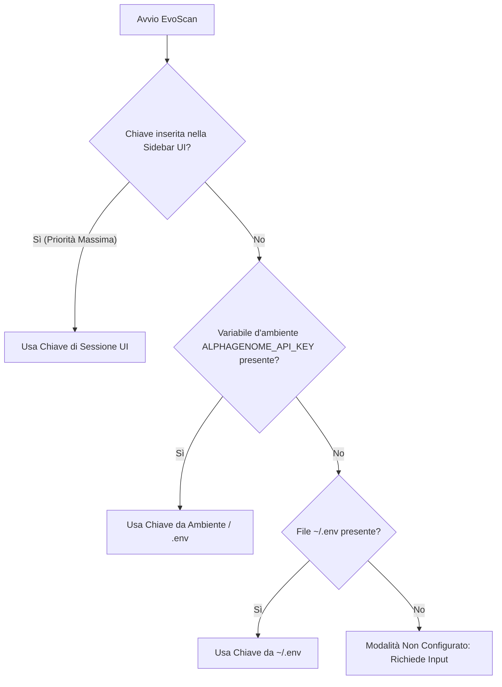

# Guida alla Configurazione della Chiave API Personale Google DeepMind AlphaGenome

> [!IMPORTANT]
> **Requisito Chiave API Personale:** Per interrogare i server cloud gRPC di **Google DeepMind AlphaGenome Atlas** attraverso **EvoScan**, ogni utente deve disporre di una propria chiave API personale. EvoScan non include chiavi condivise o preconfigurate nel codice di produzione.

---

## 1. Come ottenere la tua Chiave API Personale

L'accesso alle API di AlphaGenome Atlas è fornito gratuitamente da Google DeepMind per scopi di **ricerca accademica e scientifica non commerciale (Research Use Only - RUO)**.

Segui questa procedura passo-passo:

1. **Visita il Portale API Ufficiale:**  
   Accedi alla pagina: [**https://deepmind.google.com/science/alphagenome/api**](https://deepmind.google.com/science/alphagenome/api).
2. **Autenticati con il tuo Account Google:**  
   Clicca su **Sign In** utilizzando il tuo account Google o istituzionale.
3. **Richiedi l'Accesso API (Research Use Only):**  
   Compila il modulo indicando il tuo istituto di ricerca / università e l'ambito dello studio.
4. **Accetta i Termini di Servizio (Terms of Service):**  
   Prendi visione della licenza RUO (il modello e le predizioni non possono essere usati come unica base per diagnosi cliniche dirette senza conferma di laboratorio ortogonale).
5. **Genera e Copia la tua API Key:**  
   Verrà generata una stringa alfanumerica (del tipo `AIzaSy...`). Copiala e custodiscila in modo sicuro: non condividerla pubblicamente né committarla su repository Git pubblici.

---

## 2. Modalità di Configurazione in EvoScan

EvoScan supporta tre modalità flessibili per caricare la tua chiave API:



### Metodo A: Direttamente nell'Interfaccia Web di EvoScan (Consigliato)
1. Avvia l'interfaccia grafica:
   ```bash
   streamlit run app.py
   ```
2. Nella barra laterale sinistra (Sidebar), seleziona la modalità:  
   `🧬 Google DeepMind AlphaGenome Atlas`.
3. Incolla la tua chiave nel campo protetto:  
   **"Chiave API Personale DeepMind"** (la chiave è mascherata con `••••••••`).
4. EvoScan verificherà la chiave e mostrerà il badge verde: `🔑 API Key attiva (Personale / Sessione)`.

---

### Metodo B: File di Configurazione Locale `.env` (Persistente)
Se utilizzi EvoScan regolarmente sul tuo computer o server locale e non vuoi reinserire la chiave a ogni riavvio:

1. Crea o modifica il file `.env` all'interno della cartella principale del progetto:
   ```bash
   # Percorso: EvoScan/.env
   ALPHAGENOME_API_KEY=AIzaSy_INSERISCI_QUI_LA_TUA_CHIAVE_PERSONALE
   ```
2. EvoScan caricherà automaticamente la chiave all'avvio.

> [!NOTE]
> Il file `.env` è già incluso nel file `.gitignore` del repository per prevenire qualsiasi pubblicazione accidentale su GitHub.

---

### Metodo C: Variabile d'Ambiente di Sistema (Script e Pipeline CI/CD)
Se esegui EvoScan all'interno di container Docker, pipeline automatizzate o script Python:

- **Linux / macOS (Bash / Zsh):**
  ```bash
  export ALPHAGENOME_API_KEY="la_tua_chiave_personale"
  streamlit run app.py
  ```

- **Windows (PowerShell):**
  ```powershell
  $env:ALPHAGENOME_API_KEY="la_tua_chiave_personale"
  streamlit run app.py
  ```

- **Windows (Prompt dei Comandi CMD):**
  ```cmd
  set ALPHAGENOME_API_KEY=la_tua_chiave_personale
  streamlit run app.py
  ```

---

## 3. Verifica della Connessione gRPC

Puoi verificare che la tua chiave API sia attiva e che i server DeepMind rispondano correttamente eseguendo la suite di test automatizzati:

```bash
python -m pytest tests/test_alphagenome_engine.py
```

Se la chiave è valida, vedrai:
```text
tests\test_alphagenome_engine.py ........ [100%]
============================= 8 passed in 3.12s ==============================
```

Oppure puoi eseguire un test rapido in Python da riga di comando:

```python
from evoscan.alphagenome_engine import AlphaGenomeEngine

engine = AlphaGenomeEngine(api_key="LA_TUA_CHIAVE")
ok, msg = engine.validate_connection()
print(f"Stato connessione: {ok} - {msg}")
```

---

## 4. Limiti di Velocità (Rate Limits) e Best Practices

- **Latenza di Rete:** Le interrogazioni dense di saturazione mutagenica a 1-bp su finestre di **50-100 bp** (fino a 400 varianti computate contemporaneamente) richiedono tipicamente **meno di 1.5 secondi** via gRPC.
- **Finestra Genomica Massima Raccomandata:** Per garantire visualizzazioni fluide ed evitare timeout di rete, si raccomanda una finestra massima di **1,000 bp** per singola scansione interattiva.
- **Quote Utente:** L'API per uso di ricerca consente migliaia di richieste giornaliere. In caso di superamento temporaneo delle quote, l'API restituirà un errore HTTP 429 (`RESOURCE_EXHAUSTED`). In tal caso, attendi alcuni istanti prima di inviare una nuova richiesta.

---

## 5. Risoluzione dei Problemi Comuni

| Errore Riscontrato | Possibile Causa | Soluzione |
| :--- | :--- | :--- |
| `UNAUTHENTICATED` / `API_KEY_INVALID` | La chiave inserita non è corretta, contiene spazi o è stata revocata. | Rigenera la chiave su [Google DeepMind](https://deepmind.google.com/science/alphagenome/api) e verifica di non aver incluso caratteri spuri. |
| `Chiave API mancante` | Nessuna chiave è stata specificata né nella UI né nelle variabili d'ambiente. | Incolla la tua chiave nella barra laterale di EvoScan. |
| `PERMISSION_DENIED` | La chiave non è autorizzata per l'endpoint AlphaGenome Atlas. | Verifica che la registrazione al programma AlphaGenome RUO sia stata approvata. |
| `DEADLINE_EXCEEDED` | Timeout della connessione gRPC verso i server Google. | Verifica la tua connessione internet o riduci la dimensione della finestra genomica. |

---

## 6. Risorse e Riferimenti Utili

- 🌐 [Portale Ufficiale AlphaGenome Atlas](https://deepmind.google.com/science/alphagenome/atlas)
- 🔑 [Richiesta Chiave API Google DeepMind](https://deepmind.google.com/science/alphagenome/api)
- 📚 [Guida Completa AlphaGenome Atlas in EvoScan](file:///c:/Users/david/Documents/Google%20Antigravity/EvoScan/ALPHAGENOME_ATLAS_GUIDE.md)
- 🏗️ [Blueprint di Integrazione e Analisi Pro/Contro](file:///c:/Users/david/Documents/Google%20Antigravity/EvoScan/EVOSCAN_ALPHAGENOME_INTEGRATION.md)
