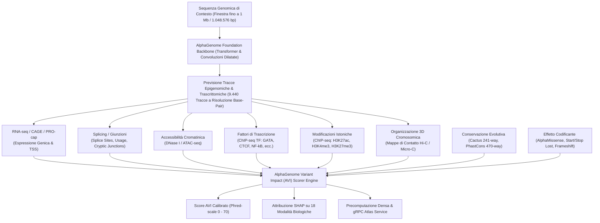

# 🧬 Google DeepMind AlphaGenome Atlas: Guida Tecnica Completa

[](https://deepmind.google.com/science/alphagenome/atlas)
[](https://github.com/google-deepmind/science-skills)
[](https://deepmind.google.com/science/alphagenome/)

---

## 1. Introduzione ed Obiettivi Scientifici

**AlphaGenome Atlas** è la piattaforma web e la risorsa genomica open-access rilasciata da **Google DeepMind** per la decifrazione su scala genomica dell'impatto funzionale delle varianti genetiche del DNA umano:
🔗 **URL Piattaforma:** [https://deepmind.google.com/science/alphagenome/atlas](https://deepmind.google.com/science/alphagenome/atlas)

A differenza dei tradizionali modelli di mutazione o dei modelli di linguaggio genomico generici (come *Nucleotide Transformer* o *DNABERT*), che valutano le sequenze principalmente in base alla probabilità statistica della sequenza o alla "perplessità" evolutiva, AlphaGenome Atlas si basa su un **modello genomico unificato (*unifying genomics model*)** addestrato per prevedere direttamente le misurazioni biologiche e biochimiche di oltre **9.440 tracce sperimentali multi-omiche** a partire dalla sequenza primaria di DNA.

Con AlphaGenome Atlas, Google DeepMind ha precomputato e mappato la **saturazione mutagenica (*dense saturation mutagenesis*)** dell'intero genoma umano di riferimento (**GRCh38**), valutando **miliardi di possibili sostituzioni a singolo nucleotide (SNV)** e varianti strutturali, correlandole a 18 modalità biologiche distinte e fornendo un indice di impatto calibrato (**AlphaGenome Variant Impact - AVI**).

---

## 2. Architettura Computazionale e Biologica di AlphaGenome

AlphaGenome modella la relazione tra sequenza e funzione biologica superando il classico approccio "black box" basato solo su annotazioni di patogenicità retrospettive (come ClinVar).



### 2.1. Finestra di Contesto di 1 Megabase (1.048.576 bp)
I modelli convenzionali di Deep Learning genomico elaborano finestre locali ridotte (es. da 512 bp a pochi kilobasi), perdendo elementi regolatori distali fondamentali:
- **Enhancer distali** situati a centinaia di kilobasi dal promotore target.
- **Isolatori e loop cromatinici CTCF** che definiscono i domini di associazione topologica (TAD).
- **Splicing a lungo raggio** tra esoni distanziati da introni mastodontici.

AlphaGenome elabora una finestra di contesto ultra-lunga fino a **1 Mb ($2^{20} = 1.048.576\text{ bp}$)**, catturando la complessa sintassi tridimensionale ed epigenetica del genoma umano a risoluzione di singola base.

---

## 3. Le 18 Modalità Biologiche di AlphaGenome Variant Impact (AVI)

Il framework **AVI** sintetizza l'impatto genomico su **18 categorie funzionali** tracciabili, garantendo la decostruzione causale della mutazione:

| N° | Chiave Modale (`modality_key`) | Nome Visualizzato nell'Atlas | Categoria Biologica | Descrizione del Meccanismo Biologico |
|:--:|:---|:---|:---|:---|
| **1** | `MERGED_SPLICING` | **Splicing** | Splicing | Alterazione di donatori/accettori di splicing, efficienza d'uso del sito e comparsa di giunzioni criptiche o pseudo-esoni. |
| **2** | `MAX_ABS_RNA_SEQ` | **RNA-seq** | Trascrizione | Alterazione quantitativa dell'abbondanza di trascritto (log2 fold change di espressione). |
| **3** | `MAX_ABS_ATAC` | **ATAC-seq** | Accessibilità Cromatinica | Guadagno o perdita di accessibilità della cromatina misurata tramite transposasi. |
| **4** | `MAX_ABS_DNASE` | **DNASE-seq** | Accessibilità Cromatinica | Disruzione di siti ipersensibili alla DNasi I (DHS) nei promotori ed enhancer. |
| **5** | `MAX_ABS_CHIP_TF` | **ChIP-TF** | Binding Fattori Trascrizionali | Creazione o distruzione di motivi di legame per centinaia di TF (es. GATA, CEBP, CTCF, HNF1, AP-1). |
| **6** | `MAX_ABS_CHIP_HISTONE` | **ChIP-Histone** | Epigenetica / Istoni | Alterazione di modificazioni post-traduzionali istoniche (es. H3K27ac per enhancer attivi, H3K4me3 per promotori). |
| **7** | `MAX_ABS_CAGE` | **CAGE** | Trascrizione / TSS | Spostamento o soppressione del sito d'inizio della trascrizione (Cap Analysis Gene Expression). |
| **8** | `MAX_ABS_PROCAP` | **PRO-cap** | Trascrizione / TSS | Disruzione dell'inizio precoce della trascrizione della RNA polimerasi. |
| **9** | `MAX_ABS_POLYADENYLATION`| **Polyadenylation** | Trascrizione / 3' UTR | Alterazione dei segnali canonici di poliadenilazione (AATAAA/ATTAAA) al 3' UTR con perdita di stabilità dell'mRNA. |
| **10**| `MAX_ABS_CONTACT_MAPS` | **3D Genome Contacts** | Organizzazione 3D | Riorganizzazione dei contatti genomici e dei loop cromatinici a lunga distanza. |
| **11**| `ALPHAMISSENSE` | **AlphaMissense** | Impatto Proteico | Predizione dell'effetto patogenetico sulle sostituzioni aminoacidiche codificanti. |
| **12**| `CACTUS_241_WAY` | **Cactus** | Conservazione Evolutiva | Conservazione filogenetica multi-specie allineata su 241 genomi di mammiferi. |
| **13**| `PROTEIN_TERMINATION` | **Protein Termination**| Conseguenza Codificante | Creazione di codoni di stop prematuri (mutazioni non-senso) o disruzione del frame. |
| **14**| `START_LOST` | **Start Lost** | Conseguenza Codificante | Perdita del codone canonico d'inizio metionina (ATG). |
| **15**| `STOP_LOST` | **Stop Lost** | Conseguenza Codificante | Perdita del codone di stop naturale con conseguente estensione anomala del polipeptide. |
| **16**| `PHASTCONS_470_WAY` | **PhastCons 470** | Conservazione Evolutiva | Conservazione nucleotidica tra 470 specie di vertebrati. |
| **17**| `IS_INSERTION` | **Insertion** | Variante Strutturale | Micro-inserzioni e duplicazioni in tandem. |
| **18**| `IS_DELETION` | **Deletion** | Variante Strutturale | Micro-delezioni genomiche con disruzione di elementi funzionali. |

---

## 4. Metriche di Punteggio e Calibrazione Statistica (AVI Phred)

AlphaGenome Atlas adotta una scala calibrata uniforme per tutte le varianti:

### 4.1. Calibrazione Phred-Scale
Dato il quantile di coda calcolato sul background di tutte le varianti possibili del genoma umano:
$$\text{Tail Quantile} = 1.0 - \text{CDF}(\text{score})$$
$$\text{AVI Phred} = -10 \cdot \log_{10}(\text{Tail Quantile})$$

| Punteggio AVI Phred | Percentile Genoma Umano | Interpretazione dell'Impatto Molecolare |
|:---:|:---:|:---|
| **$\ge 40.0$** | **Top 0.01%** (1 variante su 10.000) | Impatto molecolare estremo (disruzione di promotori core, siti donatori/accettori di splicing canonici, stop gain critici). |
| **$\ge 30.0$** | **Top 0.10%** (1 variante su 1.000) | Impatto molecolare severo (perdita di binding TF cruciali in enhancer chiave, splicing deregolato). |
| **$\ge 20.0$** | **Top 1.00%** (1 variante su 100) | Impatto funzionale significativo / moderato. |
| **$\ge 15.0$** | **Top 3.16%** | Variazione regolatoria degna di nota. |
| **$\ge 10.0$** | **Top 10.0%** | Effetto borderline o debolmente penetrante. |
| **$< 10.0$** | **Bottom 90%** | Variante verosimilmente neutrale o non funzionale. |

### 4.2. Punteggio Grezzo vs. Quantile
- **Raw Score (`avi_raw`):** Dimensione fisica dell'effetto predetto nella specifica modalità (es. in RNA-seq corrisponde approssimativamente al $\log_2(\text{fold change})$: $-1.0 \approx 50\%$ di riduzione, $-4.0 \approx 16\times$ riduzione).
- **Quantile Score (`avi_quantile`):** Rango relativo normalizzato rispetto alla distribuzione delle varianti genomiche di background.
- **Top Feature Importance:** Peso d'attribuzione SHAP che indica quale delle 18 modalità ha guidato lo score primario.

---

## 5. Ecosistema Dati e Strumenti di Accesso

Google DeepMind fornisce l'accesso ad AlphaGenome Atlas attraverso 4 canali complementari:

### 5.1. Esploratore Web Interattivo (Web UI)
Consente di inserire:
- Coordinate genomiche (es. `chr11:5288500-5290500`)
- Simboli genici (es. `HBB`, `BRCA1`, `TP53`)
- Singole varianti (es. `chr9:128226027:G>A`)

La Web UI renderizza:
1. **Heatmap regolatorie 2D:** Visualizzazione dinamica Ref vs Alt.
2. **Archi Sashimi per lo Splicing:** Mostra la formazione di giunzioni canoniche vs giunzioni aberranti / exon skipping con lo score di abbondanza relativo.
3. **Motif Footprinting & CWM (Contribution Weight Matrices):** Visualizzazione dei loghi nucleotidici ISM attivi con evidenziazione del sito di legame TF compromesso o generato *de novo*.

### 5.2. Download Massivo di Dataset Tabix (Bulk Artifacts)
Per l'analisi locale ad alto throughput, DeepMind mette a disposizione archivi Tabix precomputati:

1. **AVI SNV Scores & Phred Scores (`avi_scores_snvs_tabix.zip`)**
   - **Dimensione:** 88.5 GB
   - **Licenza:** Permissiva (uso commerciale e non commerciale)
   - **Contenuto:** Punteggi AVI grezzi, quantili e Phred per tutti i possibili SNV del genoma umano.
2. **AlphaGenome SNV Merged Splicing Scores (`combined_splicing_snvs_tabix.zip`)**
   - **Dimensione:** 20.6 GB
   - **Licenza:** Solo per uso non commerciale
   - **Contenuto:** Punteggi di disruzione dello splicing combinati per tutti i loci esonici/intronici.
3. **AVI SNV Feature Importance Scores (`avi_feature_importances_snvs_tabix.zip`)**
   - **Dimensione:** 283.9 GB
   - **Licenza:** Solo per uso non commerciale
   - **Contenuto:** Vettori completi di attribuzione d'importanza SHAP per le 18 modalità.

### 5.3. API gRPC e Python SDK (`alphagenome`)
AlphaGenome espone un endpoint gRPC ad alte prestazioni (`gdmscience.googleapis.com:443`) con le seguenti funzionalità:
- `client.query_interval()`: Restituisce istantaneamente (1.5 - 3 secondi) la matrice di saturazione mutagenica per finestre fino a 1.000 bp ($3 \times 1.000 = 3.000\text{ varianti}$).
- `client.query_variant()`: Restituisce l'annotazione completa di una singola variante con la decomposizione delle 18 modalità.
- `client.scorer_metadata()`: Fornisce l'ontologia UBERON/CL e l'elenco di 9.440 tracce.

### 5.4. Google DeepMind Science Skills (v1.2.0)
La suite open-source integrata in Antigravity e CLI include:
- `alphagenome_variant_impact_score`: CLI unificata (`alphagenome_atlas_avi.py`) per subcomandi `query`, `annotate`, `region`, `metadata`, `gtf`.
- `alphagenome_atlas_website_links`: Generatore automatico di deep-link specifici (`alphagenome_atlas_links.py`) per proiettare varianti locali direttamente sull'interfaccia grafica DeepMind.

---

## 6. Esempio Pratico di Flusso di Lavoro (CLI / Python)

### 6.1. Scansione di una Finestra di Saturazione Mutagenica (`region`)
```bash
# Esegue in 2 secondi la scansione densa di un promotore di 100 bp (300 SNV)
uv run scripts/alphagenome_atlas_avi.py region \
  --region chr11:5225720-5225820 \
  --min_phred 15.0 \
  --top_k 10 \
  --output hbb_promoter_hotspots.tsv
```

### 6.2. Interrogazione Dettagliata con Attribuzione Multi-Omica (`query`)
```bash
# Interroga una variante splice donor in CAPN3
uv run scripts/alphagenome_atlas_avi.py query "chr15:42387805:C>G" \
  --include_track_info \
  --format json \
  -o capn3_variant_report.json
```

### 6.3. Generazione Deep-Link con Tracce Pinned
```bash
# Genera URL interattivo con visualizzazione accoppiata RNA-seq + Splicing
uv run scripts/alphagenome_atlas_links.py track-predictions \
  --variant "chr15:42387805:C>G" \
  --gene CAPN3 \
  --biosample "Muscle_Skeletal"
```

---

## 7. Avvertenze Regolatorie e Limiti Noti

1. **Uso Esclusivamente per la Ricerca (RUO):** AlphaGenome Atlas è formalmente classificato come strumento di ricerca scientifica. È severamente vietato l'uso per diagnosi cliniche dirette o decisioni terapeutiche senza validazione ortogonale conforme ai protocolli di laboratorio accreditati (ACMG/AMP).
2. **Dipendenza dal Genoma di Riferimento:** I modelli attuali dell'Atlas sono parametrizzati su GRCh38. Sequenze de-novo prive di coordinate genomiche non beneficiano della precomputazione densa e richiedono l'esecuzione del modello base via inferenza diretta.
3. **Varianti Strutturali Complesse:** Sebbene SNV, piccole inserzioni e delezioni siano modellate con eccezionale accuratezza, riarrangiamenti complessi su larga scala (inversioni, traslocazioni bilanciate) necessitano di attenta interpretazione delle mappe di contatto 3D.
