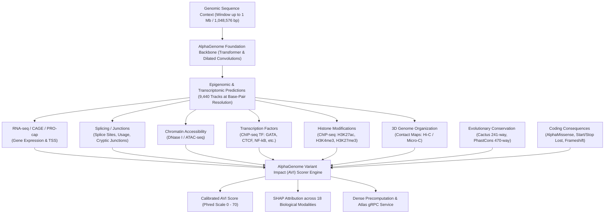

# 🧬 Google DeepMind AlphaGenome Atlas: Comprehensive Technical Guide

---

## 1. Introduction & Scientific Objectives

**AlphaGenome Atlas** is an open-access genomic resource and web platform developed by **Google DeepMind** for genome-wide functional interpretation of human DNA genetic variants:
🔗 **Platform URL:** [https://deepmind.google.com/science/alphagenome/atlas](https://deepmind.google.com/science/alphagenome/atlas)

Unlike traditional mutation models or generic genomic language models (such as *Nucleotide Transformer* or *DNABERT*)—which evaluate sequences primarily on statistical sequence likelihood or evolutionary perplexity—AlphaGenome Atlas is built upon a **unifying genomics foundation model** trained to directly predict the experimental measurements of over **9,440 multi-omic tracks** directly from primary DNA sequence.

With AlphaGenome Atlas, Google DeepMind precomputed **dense saturation mutagenesis** across the entire human reference genome (**GRCh38**), scoring **billions of candidate single nucleotide variants (SNVs)** and structural variants across 18 distinct biological modalities and calibrating them into a unified **AlphaGenome Variant Impact (AVI)** metric.

---

## 2. Computational & Biological Architecture

AlphaGenome models the sequence-to-function mapping, moving beyond classic "black box" models trained strictly on retrospective pathogenicity annotations (such as ClinVar).

### 2.1. 1-Megabase Context Window (1,048,576 bp)
Conventional deep learning models in genomics operate on narrow receptive fields (e.g. 512 bp to a few kilobases), missing critical distal regulatory elements:
- **Distal enhancers** located hundreds of kilobases from target promoters.
- **CTCF chromatin insulators and loops** defining topologically associating domains (TADs).
- **Long-range alternative splicing** across massive introns.

AlphaGenome processes an ultra-long context window of up to **1 Mb ($2^{20} = 1,048,576\text{ bp}$)**, capturing long-range 3D syntax and epigenomic regulation at single base-pair resolution.

---

## 3. The 18 Biological Modalities of AlphaGenome Variant Impact (AVI)

The **AVI** framework decomposes variant impact into **18 interpretable functional categories**:

| # | Modality Key (`modality_key`) | Atlas Display Label | Biological Category | Description & Biological Mechanism |
|:--:|:---|:---|:---|:---|
| **1** | `MERGED_SPLICING` | **Splicing** | Splicing | Disruption of canonical splice donors/acceptors, shifts in splice site usage, and activation of cryptic junctions or pseudo-exons. |
| **2** | `MAX_ABS_RNA_SEQ` | **RNA-seq** | Transcription | Quantitative alteration of steady-state transcript abundance (log2 fold change in expression). |
| **3** | `MAX_ABS_ATAC` | **ATAC-seq** | Chromatin Accessibility | Gain or loss of open chromatin accessibility measured by transposase insertion. |
| **4** | `MAX_ABS_DNASE` | **DNASE-seq** | Chromatin Accessibility | Disruption of DNase I hypersensitive sites (DHS) at active promoters and enhancers. |
| **5** | `MAX_ABS_CHIP_TF` | **ChIP-TF** | Transcription Factor Binding | Creation or destruction of transcription factor binding motifs (e.g., GATA, CEBP, CTCF, HNF1, AP-1). |
| **6** | `MAX_ABS_CHIP_HISTONE` | **ChIP-Histone** | Epigenetics / Histones | Remodeling of post-translational histone modifications (e.g., H3K27ac for active enhancers, H3K4me3 for promoters). |
| **7** | `MAX_ABS_CAGE` | **CAGE** | Transcription / TSS | Shift or suppression of transcription start sites (Cap Analysis Gene Expression). |
| **8** | `MAX_ABS_PROCAP` | **PRO-cap** | Transcription / TSS | Disruption of nascent transcription initiation by RNA polymerase. |
| **9** | `MAX_ABS_POLYADENYLATION`| **Polyadenylation** | Transcription / 3' UTR | Alteration of canonical polyadenylation signals (AATAAA/ATTAAA) in 3' UTRs leading to mRNA instability. |
| **10**| `MAX_ABS_CONTACT_MAPS` | **3D Genome Contacts** | 3D Organization | Rearrangement of chromatin contact maps and long-range chromosomal loops. |
| **11**| `ALPHAMISSENSE` | **AlphaMissense** | Protein Impact | Predicted pathogenicity on missense amino acid substitutions. |
| **12**| `CACTUS_241_WAY` | **Cactus** | Evolutionary Conservation | Multi-species phylogenetic conservation aligned across 241 mammalian genomes. |
| **13**| `PROTEIN_TERMINATION` | **Protein Termination**| Coding Consequence | Introduction of premature stop codons (nonsense mutations) or frameshifts. |
| **14**| `START_LOST` | **Start Lost** | Coding Consequence | Loss of canonical initiator methionine codon (ATG). |
| **15**| `STOP_LOST` | **Stop Lost** | Coding Consequence | Loss of natural termination codon causing polypeptide extension. |
| **16**| `PHASTCONS_470_WAY` | **PhastCons 470** | Evolutionary Conservation | Nucleotide sequence conservation across 470 vertebrate species. |
| **17**| `IS_INSERTION` | **Insertion** | Structural Variant | Small insertions and tandem duplications. |
| **18**| `IS_DELETION` | **Deletion** | Structural Variant | Genomic micro-deletions disrupting functional elements. |

---

## 4. Scoring Metrics & Statistical Calibration (AVI Phred)

AlphaGenome Atlas standardizes predictions onto a calibrated, genome-wide scale:

### 4.1. Phred-Scale Calibration
Given the tail quantile evaluated against the empirical background of all possible human SNVs:
$$\text{Tail Quantile} = 1.0 - \text{CDF}(\text{score})$$
$$\text{AVI Phred} = -10 \cdot \log_{10}(\text{Tail Quantile})$$

| AVI Phred Score | Human Genome Percentile | Molecular Impact Tier |
|:---:|:---:|:---|
| **$\ge 40.0$** | **Top 0.01%** (1 in 10,000 variants) | Extreme molecular disruption (core promoter collapse, canonical splice junction loss, critical nonsense stop). |
| **$\ge 30.0$** | **Top 0.10%** (1 in 1,000 variants) | Severe disruption (loss of essential TF binding at key enhancers, aberrant splicing). |
| **$\ge 20.0$** | **Top 1.00%** (1 in 100 variants) | High / moderate functional impact. |
| **$\ge 15.0$** | **Top 3.16%** | Notable regulatory alteration. |
| **$\ge 10.0$** | **Top 10.0%** | Moderate or weakly penetrant regulatory effect. |
| **$< 10.0$** | **Bottom 90%** | Evolutionarily tolerated or benign variant. |

### 4.2. Raw Score vs. Quantile
- **Raw Score (`avi_raw`):** Physical magnitude in the specific modality (e.g., in RNA-seq it corresponds roughly to $\log_2(\text{fold change})$: $-1.0 \approx 50\%$ reduction, $-4.0 \approx 16\times$ reduction).
- **Quantile Score (`avi_quantile`):** Relative normalized rank against genome-wide background variants.
- **Top Feature Importance:** SHAP attribution weights highlighting which of the 18 modalities drove the composite impact score.

---

## 5. Data Ecosystem & Access Channels

Google DeepMind provides access to AlphaGenome Atlas through 4 complementary channels:

### 5.1. Interactive Web Explorer (Web UI)
Enables searching by:
- Genomic coordinates (e.g. `chr11:5288500-5290500`)
- Gene symbols (e.g. `HBB`, `BRCA1`, `TP53`)
- Individual variants (e.g. `chr9:128226027:G>A`)

The Web UI renders:
1. **2D Regulatory Heatmaps:** Ref vs. Alt comparative overlays.
2. **Sashimi Plots for Splicing:** Visualizes canonical junctions vs. aberrant exon skipping with junction read shares.
3. **Motif Footprinting & CWMs:** In silico mutagenesis (ISM) logos highlighting TF binding disruption or de novo creation.

### 5.2. Bulk Tabix Datasets
For high-throughput local pipelines, DeepMind provides precomputed Tabix archives:
1. **AVI SNV Scores & Phred Scores (`avi_scores_snvs_tabix.zip`)** (88.5 GB, Permissive License)
2. **AlphaGenome SNV Merged Splicing Scores (`combined_splicing_snvs_tabix.zip`)** (20.6 GB, Non-Commercial)
3. **AVI SNV Feature Importance Scores (`avi_feature_importances_snvs_tabix.zip`)** (283.9 GB, Non-Commercial)

### 5.3. High-Performance gRPC API & Python SDK (`alphagenome`)
AlphaGenome exposes a low-latency gRPC endpoint (`gdmscience.googleapis.com:443`):
- `client.query_interval()`: Returns dense saturation mutagenesis matrices for windows up to 1,000 bp ($3 \times 1,000 = 3,000\text{ variants}$) in $1.5 - 3$ seconds.
- `client.query_variant()`: Complete multi-modal variant report with SHAP decomposition.
- `client.scorer_metadata()`: UBERON/CL tissue ontologies and metadata across all 9,440 tracks.

### 5.4. Google DeepMind Science Skills (v1.2.0)
- `alphagenome_variant_impact_score`: Unified CLI (`alphagenome_atlas_avi.py`) for `query`, `annotate`, `region`, `metadata`, and `gtf`.
- `alphagenome_atlas_website_links`: Generates deep-links (`alphagenome_atlas_links.py`) directly linking variants to the web Atlas.

---

## 6. Regulatory Notes & Scope

1. **Research Use Only (RUO):** AlphaGenome Atlas is classified as a scientific research tool. It must not be used as the sole basis for clinical diagnosis or treatment decisions without orthogonal validation according to accredited clinical laboratory standards (ACMG/AMP).
2. **Reference Genome Dependency:** Models are currently parameterized for GRCh38. De-novo synthetic sequences lacking coordinates require local direct inference (e.g. via Nucleotide Transformer).
3. **Complex Structural Variants:** While SNVs, small insertions, and deletions are modeled with high accuracy, large-scale rearrangements (inversions, balanced translocations) require careful multi-megabase 3D contact map interpretation.
