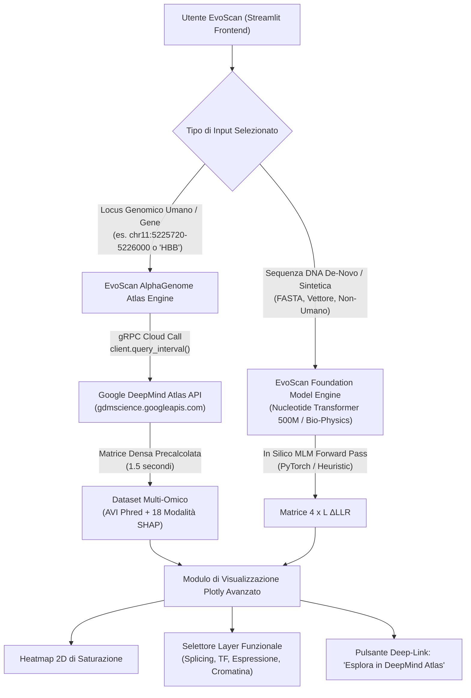
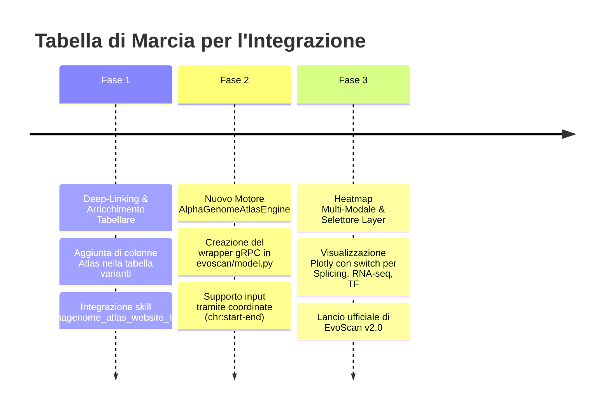

# 🔬 Integrazione di AlphaGenome Atlas in EvoScan: Analisi di Fattibilità, Architettura e Valutazione Pro/Contro

[](README.md)
[](https://deepmind.google.com/science/alphagenome/atlas)
[](#)

---

## 1. Sintesi Esecutiva e Visione

**EvoScan** è un visualizzatore avanzato per la mutagenesi a saturazione *in silico* (*Deep Mutational Scanning - DMS*), attualmente incentrato sull'estrazione di Log-Likelihood Ratio ($\Delta\text{LLR}$) tramite modelli linguistici genomici fondazionali basati su 6-meri (*Nucleotide Transformer 500M / v2*).

Il rilascio di **Google DeepMind AlphaGenome Atlas** rappresenta un'opportunità di evoluzione fondamentale:
- **Oggi EvoScan** calcola una misura unidimensionale di "accettabilità evolutiva / perplessità statistica della sequenza". Risponde alla domanda: *"Questa mutazione è insolita rispetto alla grammatica del DNA appresa dal Transformer?"*.
- **Con AlphaGenome Atlas, EvoScan** può rispondere alla domanda biologica e clinica fondamentale: *"Perché questa mutazione è deleteria? Distrugge lo splicing? Sopprime l'espressione di un gene specifico? Chiude la cromatina? O distrugge il sito di legame per un fattore di trascrizione in un determinato tessuto?"*.

L'integrazione di AlphaGenome Atlas in EvoScan è **tecnicamente fattibile, altamente sinergica e strategicamente raccomandata**, trasformando EvoScan da uno strumento di sola sequenza a una **piattaforma di visualizzazione multi-omica e clinico-funzionale**.

---

## 2. Matrice Comparativa: EvoScan Attuale vs. AlphaGenome Atlas

| Caratteristica Architetturale | EvoScan (Stato Attuale) | AlphaGenome Atlas (DeepMind) | Sinergia di Integrazione |
|:---|:---|:---|:---|
| **Input Primario** | Sequenza grezza di DNA (FASTA/Testo). | Coordinate genomiche umane (`chr:start-end`, gene, variante). | **Architettura Duale:** Sequenze de-novo su Nucleotide Transformer; loci umani su Atlas. |
| **Finestra di Contesto** | Locale ($\sim 50\text{ bp} - 1.000\text{ bp}$ analizzati; contesto modello $\sim 1\text{ kb}-12\text{ kb}$). | **1 Megabase (1.048.576 bp)** con risoluzione a singolo nucleotide. | Superamento dei limiti di contesto locale e cattura di enhancer a centinaia di kb. |
| **Tokenizzazione** | Chunk fissi **6-meri non sovrapposti** ($4^6 = 4096$ token). | **Tokenizzazione a singolo nucleotide** a risoluzione 1 bp. | Eliminazione degli artefatti ai confini dei 6-meri (*boundary artifacts*). |
| **Punteggio Primario** | $\Delta\text{LLR}$ (Log-Likelihood Ratio univariato). | **AVI Phred Score (0 - 70)** calibrato sul genoma + 18 feature SHAP. | Benchmark standardizzato: identificazione immediata del Top 0.01% di varianti deleterie. |
| **Specificità di Tessuto** | Nessuna (modello non condizionato da tessuti o linee cellulari). | **9.440 tracce sperimentali** (HepG2, K562, cuore, cervello, muscolo, ecc.). | Heatmap condizionate per tessuto d'interesse (es. fegato vs rene). |
| **Specificità di Meccanismo** | Statistica pura di sequenza (perplessità del modello). | **18 modalità biologiche** (Splicing, TF, Istoniche, RNA-seq, CAGE, 3D Contacts). | Deconvoluzione causale della mutazione direttamente nell'interfaccia. |
| **Risorse Computazionali** | Richiede GPU con 2-4 GB VRAM o CPU lenta con PyTorch. | **Invocazione gRPC ultra-rapida ($<2\text{ s}$ per 1 kb)**; zero VRAM locale. | Scalabilità istantanea su dispositivi client/browser e demo web senza GPU. |
| **Supporto Sequenze Sintetiche** | **Completo** (plasmidi, promotori sintetici, batteri, piante). | **Limitato a GRCh38** per l'Atlas precomputato (richiede API completa per de-novo). | La coesistenza dei due motori preserva il caso d'uso sintetico. |

---

## 3. Schemi di Integrazione Proposti

### 3.1. Architettura a Doppio Motore (Dual-Engine Pipeline)



### 3.2. Deconvoluzione Funzionale con Heatmap Multi-Layer
Attualmente la heatmap di EvoScan mostra solo $\Delta\text{LLR}$. Con AlphaGenome Atlas, EvoScan può introdurre un selettore di livello funzionale:
1. **Layer Globale:** Punteggio `AVI Phred` (impatto molecolare aggregato da 0 a 70).
2. **Layer Splicing:** Disruzione donatori/accettori ed exon skipping (`MERGED_SPLICING`).
3. **Layer Trascrizionale:** Variazione d'espressione quantitativa (`RNA_SEQ`).
4. **Layer Accessibilità:** Variazione di cromatina aperta (`DNASE` / `ATAC`).
5. **Layer Regolatorio:** Disruzione di motivi per fattori di trascrizione (`CHIP_TF`).

### 3.3. Deep-Linking Automatico dall'Interactive Variant Table
Ogni riga della tabella interattiva di EvoScan (es. mutazione `chr11:5225727:T>G` o hotspot del promotore) conterrà un link generato tramite `alphagenome_atlas_links.py`:
- Cliccando sul link, l'utente viene reindirizzato istantaneamente alla pagina **AlphaGenome Atlas** con:
  - Lo zoom centrato esattamente sulla variante.
  - Le tracce sperimentali pertinenti (*RNA-seq*, *splicing sashimi arcs*, *DNase*).
  - Il logo del motivo nucleotidico (CWM / Active-ISM) che mostra il fattore di trascrizione compromesso.

---

## 4. Valutazione Approfondita: Pro e Contro

### 4.1. VANTAGGI (PRO)

1. **Interpretabilità Biologica Rivoluzionaria:**
   - La principale critica ai modelli come Nucleotide Transformer è che il $\Delta\text{LLR}$ è un indice "cieco": indica che una mutazione è anomala, ma non fornisce spiegazioni biologiche.
   - AlphaGenome scompone l'effetto in 18 modalità biologiche tangibili, permettendo al ricercatore di capire se il danno è trascrizionale, post-trascrizionale, conformazionale o proteico.
2. **Prestazioni Estreme a Zero Costo Computazionale Locale:**
   - Eseguire una scansione di saturazione con Nucleotide Transformer su una sequenza di 1.000 bp richiede circa $3.000$ inferenze se fatta con per-token MLM o un forward pass computazionalmente oneroso in RAM.
   - Con AlphaGenome Atlas, una finestra genomica di 1.000 bp viene recuperata tramite gRPC in **meno di 2 secondi**, eliminando il bisogno di schede video dedicate (NVIDIA CUDA) sul server EvoScan.
3. **Eliminazione degli Artefatti da 6-Mero:**
   - Nucleotide Transformer elabora stringhe di 6 nucleotidi senza overlap. Questo introduce artefatti al bordo di ciascun chunk. AlphaGenome opera a risoluzione di singola base, garantendo una superficie energetica perfettamente continua.
4. **Specificità Cellulare e Tissutale:**
   - Permette agli utenti di selezionare la linea cellulare d'interesse (es. K562 per varianti eritroidi, HepG2 per varianti epatiche, cellule neuronali per varianti cerebrali), rendendo EvoScan uno strumento personalizzabile per specifici contesti di malattia.
5. **Score Calibrato Standard di Riferimento:**
   - La scala AVI Phred ($0-70$) fornisce un valore assoluto immediatamente confrontabile tra geni e cromosomi diversi, superando la dipendenza del $\Delta\text{LLR}$ dal background di GC% locale.
6. **Integrazione Bidirezionale con DeepMind:**
   - Aggiungere deep-link verso l'Atlas valorizza EvoScan come portale analitico moderno e integrato nell'ecosistema Google DeepMind.

---

### 4.2. SVANTAGGI E SFIDE (CONTRO)

1. **Vincolo alle Coordinate del Genoma Umano (GRCh38):**
   - AlphaGenome Atlas si basa su dati precomputati sul genoma umano di riferimento. Non supporta sequenze sintetiche arbitrarie, promotori artificiali ingegnerizzati o organismi modello non umani (es. *E. coli*, lievito, piante) senza invocare il modello completo di base (che ha costi computazionali e requisiti di chiamata differenti).
   - *Soluzione:* Mantenere l'architettura a **Doppio Motore**: il motore attuale per sequenze arbitrarie, AlphaGenome Atlas per coordinate umane.
2. **Dipendenza da Rete e API Key Esterna:**
   - L'integrazione richiede che l'istanza di EvoScan (o l'utente finale) disponga di una chiave `ALPHAGENOME_API_KEY` valida e di connettività gRPC aperta verso i server Google (`gdmscience.googleapis.com:443`).
   - Se l'API è irraggiungibile o la connessione è assente, l'Atlas engine non può operare.
   - *Soluzione:* Fallback automatico ed esplicito sul motore euristico locale o su Nucleotide Transformer.
3. **Termini di Utilizzo e Limitazioni di Licenza:**
   - I dati di AlphaGenome Atlas sono destinati ad esclusivo uso di ricerca (*Research Use Only*). Non possono essere impiegati per erogare diagnosi mediche dirette o guidare terapie cliniche.
   - Alcuni artefatti Tabix (splicing, feature importance complete) hanno licenze limitate all'uso non commerciale, mentre EvoScan ha licenza open-source permissiva (MIT).
   - *Soluzione:* EvoScan deve esporre un disclaimer trasparente di ricerca (RUO) conformemente ai termini di Google DeepMind.
4. **Complessità dell'Interfaccia Utente (UI Overload):**
   - Presentare 18 tracce e decine di tessuti potrebbe compromettere la semplicità e la pulizia estetica di EvoScan.
   - *Soluzione:* Adottare un design a **progressiva rivelazione**: mostrare prima lo score globale AVI Phred, e permettere l'espansione dei singoli layer solo su richiesta esplicita dell'utente.
5. **Dimensione dei Dati per Uso Locale Offline (Bulk Storage):**
   - Se un utente volesse installare il database Atlas completamente offline senza connessione internet, gli archivi Tabix pesano tra 88.5 GB e 390 GB, un ingombro incompatibile con installazioni leggere per computer portatili.
   - *Soluzione:* Utilizzare l'accesso online gRPC come default e considerare i file Tabix locali solo per installazioni server ad alto throughput.

---

## 5. Piano di Implementazione Pratico per EvoScan

Per integrare AlphaGenome Atlas in EvoScan senza stravolgere la base di codice esistente, si raccomanda una roadmap in 3 fasi:



### Fase 1: Deep-Linking e Lancio Diretto nell'Atlas (Sforzo Basso, Alto Impatto)
- Quando una sequenza proviene da un locus umano noto o quando l'utente specifica un gene/locus nelle opzioni, l'Interactive Variant Table di EvoScan calcola automaticamente l'URL dell'Atlas tramite `scripts/alphagenome_atlas_links.py`.
- L'utente può cliccare su qualsiasi mutazione anomala per aprirla nell'Atlas con visualizzazione accoppiata di RNA-seq e giunzioni di splicing.

### Fase 2: Implementazione di `AlphaGenomeAtlasEngine` in `evoscan/model.py`
- Creazione di una nuova classe conforme all'interfaccia `EvoScanEngine`:
```python
class AlphaGenomeAtlasEngine:
    """Motore di scansione densa basato sull'API gRPC di AlphaGenome Atlas."""
    def __init__(self, api_key: Optional[str] = None):
        from alphagenome.atlas import atlas
        self.client = atlas.create(api_key or os.getenv("ALPHAGENOME_API_KEY"))

    def score_interval(self, chrom: str, start: int, end: int, modality: str = "AVI_SCORE"):
        # Interroga l'intervallo via gRPC e formatta la matrice (4 x L) per EvoScan
        ...
```
- Aggiunta di `AlphaGenome Atlas (Cloud gRPC)` all'elenco dei modelli disponibili nel menu a tendina di Streamlit (`AVAILABLE_MODELS`).

### Fase 3: Heatmap Multi-Layer e Visualizzatore Meccanicistico
- Estensione di `evoscan/viz.py` per supportare il toggle tra:
  - **AVI Phred Score (Globale)**
  - **Splicing Disruption Score**
  - **TF Binding Alteration Score**
  - **Gene Expression Impact Score**

---

## 6. Verdetto Finale

L'integrazione di **AlphaGenome Atlas** in **EvoScan** è una combinazione perfetta:
- Risolve il limite primario di EvoScan (la mancanza di interpretabilità biologica e tissutale del $\Delta\text{LLR}$).
- Potenzia la velocità di elaborazione per i loci umani (da decine di secondi di calcolo GPU a 1.5 secondi via gRPC cloud).
- Mantiene intatta la vocazione originale di EvoScan (la capacità di valutare qualunque sequenza sintetica offline tramite il motore locale esistente).

Il risultato è uno strumento scientifico di classe mondiale, capace di unire il meglio della modellazione generativa open-source locale e dei più potenti foundation models genomici di Google DeepMind.
