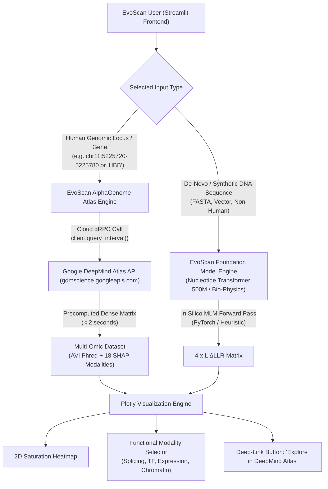

# 🔬 AlphaGenome Atlas Integration in EvoScan: Architectural Design, Feasibility, and Pros & Cons

---

## 1. Executive Summary & Vision

**EvoScan** is an interactive visualizer and computational framework for *in silico* **Deep Mutational Scanning (DMS)**, originally built to extract Log-Likelihood Ratios ($\Delta\text{LLR}$) from 6-mer genomic foundation models (*Nucleotide Transformer 500M / v2*).

The release of **Google DeepMind AlphaGenome Atlas** unlocks a major architectural leap:
- **Previously, EvoScan** computed a univariate measure of "sequence evolutionary plausibility / model perplexity", answering the question: *"Is this candidate mutation atypical relative to the DNA grammar learned by the Transformer?"*.
- **With AlphaGenome Atlas, EvoScan** can answer direct biological and mechanistic questions: *"Why is this variant disruptive? Does it break canonical splicing? Does it downregulate transcript abundance? Does it close local chromatin accessibility? Or does it ablate a critical transcription factor binding motif in a disease-relevant tissue?"*.

Integrating AlphaGenome Atlas into EvoScan establishes a **Dual-Engine Platform**, bridging sequence-level likelihood modeling with **multi-modal, clinically calibrated variant effect prediction**.

---

## 2. Comparative Matrix: EvoScan Core vs. AlphaGenome Atlas

| Architectural Dimension | EvoScan (Baseline Local) | AlphaGenome Atlas (Google DeepMind) | Dual-Engine Synergy |
|:---|:---|:---|:---|
| **Primary Input** | Raw DNA sequence (FASTA / plain text). | Human genomic coordinates (`chr:start-end`, gene, variant). | **Dual Architecture:** De-novo / synthetic sequences via Nucleotide Transformer; human loci via Atlas. |
| **Context Window** | Local ($\sim 50\text{ bp} - 1,000\text{ bp}$ scanned; model context $\sim 1\text{ kb}-12\text{ kb}$). | **1 Megabase (1,048,576 bp)** at single-base resolution. | Overcomes narrow receptive fields, capturing distal enhancers up to hundreds of kilobases away. |
| **Tokenization** | Fixed **non-overlapping 6-mers** ($4^6 = 4,096$ vocabulary tokens). | **Single-nucleotide tokenization** at 1-bp resolution. | Eliminates sub-token boundary artifacts. |
| **Scoring Metric** | $\Delta\text{LLR}$ (univariate log-likelihood ratio). | **AVI Phred Score (0–70)** calibrated genome-wide + 18 SHAP modalities. | Standardized benchmark: immediately highlights top 1% and top 0.1% pathogenic tiers. |
| **Tissue Specificity** | None (unconditioned sequence model). | **9,440 experimental tracks** across cell lines and tissues (HepG2, K562, brain, muscle, etc.). | Epigenomic and transcriptomic conditioning for disease-relevant biosamples. |
| **Mechanistic Attribution**| Statistical sequence likelihood. | **18 biological modalities** (Splicing, TF binding, Histones, RNA-seq, CAGE, 3D Contacts). | Causal deconvolution of variant impact directly inside the user interface. |
| **Computational Footprint**| Requires GPU (2–4 GB VRAM) or slower CPU with PyTorch. | **Ultra-fast gRPC (<2s for 1 kb)**; zero local GPU/VRAM needed. | Instant browser scalability on consumer laptops without specialized hardware. |
| **Synthetic DNA Support** | **Full** (plasmids, synthetic promoters, bacteria, plants). | **Constrained to GRCh38** for the precomputed Atlas service. | Preserves synthetic biology workflows while unlocking human clinical genetics. |

---

## 3. Integration Architecture & Workflow

### 3.1. Dual-Engine Pipeline

### 3.2. Multi-Layer Functional Heatmaps
While the classic heatmap presents $\Delta\text{LLR}$, the AlphaGenome engine introduces layer switching:
1. **Global Composite Layer:** `AVI Phred` score (calibrated molecular impact from 0 to 70).
2. **Splicing Layer:** Splice donor/acceptor disruption and exon skipping (`MERGED_SPLICING`).
3. **Transcriptional Layer:** Quantitative steady-state expression shifts (`RNA_SEQ`).
4. **Chromatin Layer:** Loss or gain of open chromatin (`DNASE` / `ATAC`).
5. **Regulatory Layer:** Transcription factor binding motif disruption (`CHIP_TF`).

### 3.3. One-Click Deep-Linking to DeepMind Atlas
Every row in EvoScan's interactive variant table includes a dynamic deep-link:
- Clicking **🔗 Explore in Atlas** takes the user directly to the official Google DeepMind AlphaGenome Atlas viewer centered on that variant with associated RNA-seq tracks, splicing sashimi arcs, and active-ISM motif logos.

---

## 4. In-Depth Trade-Off Analysis: Pros & Cons

### 4.1. ADVANTAGES (PROS)

1. **Unprecedented Biological Interpretability:**
   - Traditional language model $\Delta\text{LLR}$ scores are "blind" to biological mechanisms: they flag variants as atypical without explaining why. AlphaGenome decomposes impact across 18 tangible biological modalities.
2. **Extreme Performance with Zero Local Hardware Overhead:**
   - Scoring 1,000 bp locally via iterative masked language modeling requires hundreds of forward passes. AlphaGenome queries dense precomputed predictions via gRPC in **under 2 seconds**, eliminating GPU requirements.
3. **Elimination of 6-Mer Token Boundary Artifacts:**
   - Nucleotide Transformer tokenizes sequences into non-overlapping 6-mers. AlphaGenome operates at single-base resolution, ensuring a continuous energy surface.
4. **Tissue & Cell-Type Specificity:**
   - Enables filtering by tissue or biosample (e.g. liver, brain, blood), tailoring variant analysis to specific clinical phenotypes.
5. **Calibrated Reference Standard:**
   - AVI Phred ($0–70$) provides an absolute, cross-comparable scale across genes, independent of local GC% bias.
6. **Ecosystem Synergy:**
   - Directly complements DeepMind's web tools, making EvoScan a lightweight interactive explorer for the broader scientific community.

---

### 4.2. CHALLENGES & MITIGATIONS (CONS)

1. **Constrained to Human Reference (GRCh38):**
   - The precomputed Atlas is strictly parameterized for the human GRCh38 assembly. It cannot score arbitrary synthetic constructs or non-human model organisms.
   - *Mitigation:* The **Dual-Engine architecture** preserves the local Nucleotide Transformer engine for all non-GRCh38 workflows.
2. **Network & External API Key Dependency:**
   - Querying the Atlas requires active internet connectivity and an `ALPHAGENOME_API_KEY`.
   - *Mitigation:* Explicit, graceful UI warnings, personal API key inputs, and automatic fallback to local heuristic models.
3. **Research Use Only (RUO) Licensing:**
   - AlphaGenome data is strictly designated for research use and must not be used as the sole basis for clinical diagnosis.
   - *Mitigation:* EvoScan displays prominent RUO disclaimers in accordance with Google DeepMind's terms of service.
4. **UI Complexity:**
   - Displaying 18 modalities could overwhelm the clean aesthetic.
   - *Mitigation:* Progressive disclosure design—defaulting to global AVI Phred and expanding modalities upon user selection.

---

## 5. Conclusion

Integrating **AlphaGenome Atlas** into **EvoScan** creates a best-of-both-worlds scientific tool:
- Solves the interpretability bottleneck of generic genomic language models.
- Delivers sub-second saturation mutagenesis for human disease loci without requiring local GPUs.
- Retains complete offline and synthetic DNA versatility through local foundation models.
