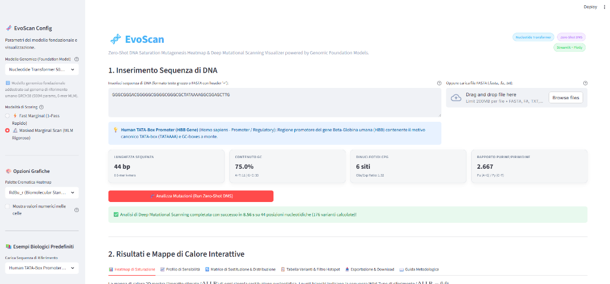
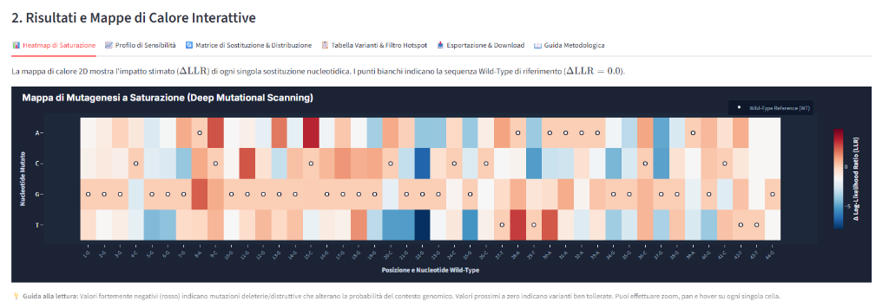
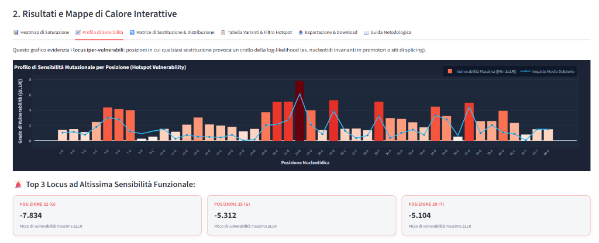
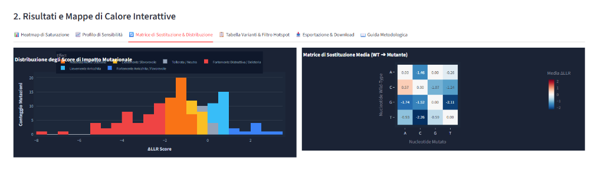
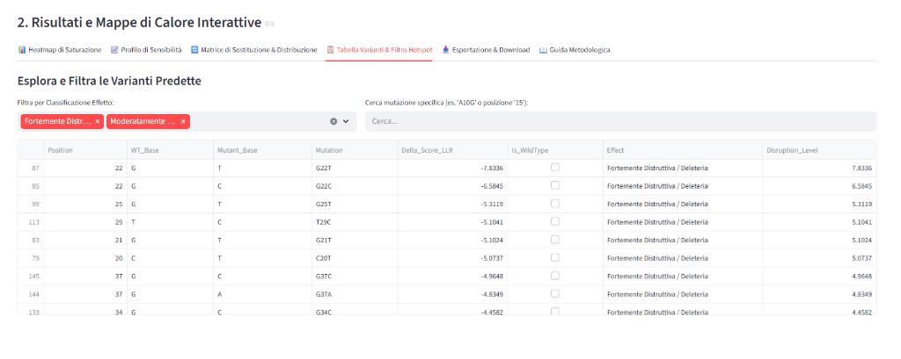
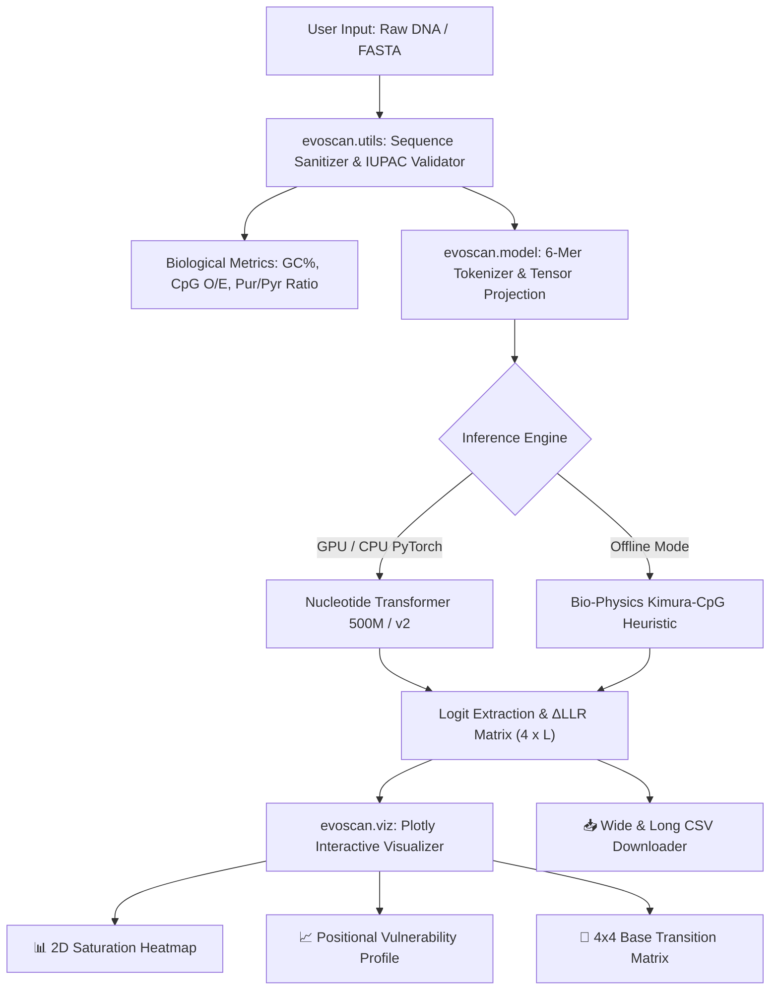

<div align="center">

# 🧬 EvoScan
### Zero-Shot DNA Saturation Mutagenesis Heatmap & Deep Mutational Scanning Visualizer

[](https://opensource.org/licenses/MIT)
[](https://www.python.org/)
[](https://pytorch.org/)
[](https://huggingface.co/)
[](https://streamlit.io/)
[](https://plotly.com/)
[](https://huggingface.co/spaces)

*An open-source bioinformatics tool for in silico saturation mutagenesis and zero-shot variant effect prediction using Genomic Foundation Models.*

---



</div>

---

## 📸 Application Gallery & Interactive Visualizations

### 1. Main Dashboard & DNA Sequence Input
*Interactive parameter controls, genomic foundation model selection, and real-time sequence quality metrics (GC%, CpG islands, purine/pyrimidine ratio).*


### 2. 2D Deep Mutational Scanning (DMS) Heatmap
*Two-dimensional interactive saturation heatmap showing $\Delta\text{LLR}$ impact for all single-nucleotide variants across every locus.*



### 3. Positional Vulnerability & Hotspot Profile
*Identifies critical regulatory loci and hyper-sensitive positions with combined bar charts and mean deleterious trend lines.*



### 4. Substitution Matrix & $\Delta\text{LLR}$ Score Distribution
*4x4 transition/transversion substitution matrix and multi-category variant effect distribution histogram.*



### 5. Interactive Variant Table & Hotspot Search
*Searchable and filterable variant catalog with real-time classification chips, mutation lookups (e.g. `A10G`), and CSV export.*



## 📌 Biological Problem & Motivation

**Deep Mutational Scanning (DMS)** is an experimental paradigm that systematically synthesizes and assays every single-nucleotide variant across a genomic region of interest. While indispensable for identifying pathogenic mutations, mapping transcriptional enhancers, and designing synthetic promoters, high-throughput DMS experiments are costly, labor-intensive, and sequence-length constrained.

**EvoScan** solves this by providing an **in silico zero-shot variant effect predictor** powered by transformer-based genomic foundation models (such as `InstaDeepAI/nucleotide-transformer-500m-human-ref` and `nucleotide-transformer-v2`).

Without requiring fine-tuning or experimental labeled datasets, EvoScan evaluates how much any single nucleotide substitution ($A \to C, G, T$) disrupts the evolutionary and linguistic grammar of DNA learned by the foundation model across millions of genomes.

---

## 🔬 Mathematical & Algorithmic Foundation

Given a genomic masked language model $\mathcal{M}$ and a wild-type DNA sequence $\mathbf{x} = (x_1, x_2, \dots, x_L)$, for every locus $j \in \{1, \dots, L\}$ and each candidate nucleotide substitution $m \in \{A, C, G, T\}$:

$$\Delta \text{LLR}(j, m) = \log P_\mathcal{M}(x_j = m \mid \mathbf{x}_{\setminus j}) - \log P_\mathcal{M}(x_j = x_j^{\text{WT}} \mid \mathbf{x}_{\setminus j})$$

### 6-Mer Token-to-Base Alignment Logic
Genomic foundation models (such as the Nucleotide Transformer series) tokenize sequences using **non-overlapping 6-mers** ($4^6 = 4096$ vocabulary tokens). To prevent dimension mismatch:
1. EvoScan maps each nucleotide position $j$ (0-indexed) to its containing 6-mer chunk $k = \lfloor j / 6 \rfloor$.
2. It computes the sub-token offset $o = j \bmod 6$.
3. It constructs the mutant 6-mer $T_k^{(m)} = T_k[:o] + m + T_k[o+1:]$.
4. It extracts logits from the model tensor $\mathbf{Z} \in \mathbb{R}^{B \times S \times V}$ and computes:
   $$\Delta \text{score}(j, m) = \mathbf{Z}[0, k, \text{vocab}(T_k^{(m)})] - \mathbf{Z}[0, k, \text{vocab}(T_k^{(\text{wt})})]$$

| $\Delta\text{LLR}$ Score Range | Biological Interpretation | Heatmap Color |
| :--- | :--- | :--- |
| $\Delta\text{LLR} = 0.0$ | **Wild-Type Reference** | White dot marker |
| $\Delta\text{LLR} \le -2.0$ | **Highly Disruptive / Deleterious** | Deep Crimson Red |
| $-2.0 < \Delta\text{LLR} \le -0.75$ | **Moderately Deleterious** | Orange / Amber |
| $-0.75 < \Delta\text{LLR} \le 0.2$ | **Tolerated / Neutral Variant** | Slate Gray |
| $\Delta\text{LLR} > 0.2$ | **Enriched / Context-Preferred** | Royal Blue |

---

## ✨ Key Features

- **🚀 Dual Scoring Engines:**
  - `⚡ Fast Marginal (1-Pass)`: Single forward pass through the unmasked wild-type sequence for real-time interactive exploration ($<0.1$s).
  - `🔬 Masked Marginal Scan (MLM)`: Sequential per-token masked language modeling evaluation according to standard DMS benchmark protocols.
  - `⚡ EvoScan Bio-Physics Fast Engine`: Zero-download heuristic engine based on Kimura 2-parameter transition/transversion penalties, CpG island disruption, and motif degradation for offline/low-resource execution.
- **📊 Interactive 2D Saturation Heatmap (Plotly):** Hover tooltips with wild-type/mutant base details, zoom/pan controls, numeric score overlay toggle, and diverging bioinformatic color palettes.
- **📈 Positional Vulnerability Profile:** Identifies mutational hotspots and hyper-conserved regulatory elements (e.g. TATA-box, splice donor/acceptor sites).
- **🔄 Substitution Matrix & Score Distribution:** Aggregated $4 \times 4$ base transition statistics ($A \to C, G, T$) and distribution histograms.
- **📋 Real-time Filtering & Search:** Filter variants by classification and locate specific mutations (e.g. `A10G`).
- **📥 Export Formats:** Download wide $4 \times L$ CSV matrix and long-format tidy datasets for downstream pipelines in R/Bioconductor, Python, or bash.
- **🧬 Biological Presets Included:** Human Beta-Globin TATA promoter, TP53 Exon 5 core, BRCA1 splice site, and synthetic transcription factor enhancers.

---

## 🏗️ Architecture Overview



---

## 🚀 Quick Start

### 1. Clone the Repository
```bash
git clone https://github.com/your-username/EvoScan.git
cd EvoScan
```

### 2. Create and Activate Virtual Environment
```bash
# Using standard Python venv
python -m venv .venv

# On Linux / macOS
source .venv/bin/activate

# On Windows (PowerShell)
.venv\Scripts\Activate.ps1
```

### 3. Install Dependencies
```bash
pip install -r requirements.txt
```

### 4. Run the Streamlit Application
```bash
streamlit run app.py
```
Open your browser at `http://localhost:8501`.

---

## 🧪 Running the Unit Test Suite

EvoScan includes a comprehensive automated test suite verifying DNA parsing, IUPAC validation, tensor alignment, and Plotly figure generation:

```bash
python -m pytest tests/ -v
```

---

## ☁️ Deployment on Hugging Face Spaces (Zero-Cost)

EvoScan is pre-configured for instant deployment on [Hugging Face Spaces](https://huggingface.co/spaces):

1. Create a new Space on Hugging Face:
   - **SDK:** `Streamlit`
   - **Hardware:** `CPU Basic (Free - 2 vCPU, 16 GB RAM)` or `T4 GPU`.
2. Clone your Space repository:
   ```bash
   git clone https://huggingface.co/spaces/YOUR_USERNAME/evoscan-dms
   cd evoscan-dms
   ```
3. Copy the EvoScan files:
   ```bash
   cp -r /path/to/EvoScan/* .
   ```
4. Commit and push:
   ```bash
   git add .
   git commit -m "Deploy EvoScan to Hugging Face Spaces"
   git push
   ```
5. Hugging Face Spaces will automatically install dependencies from `requirements.txt` and launch `app.py`.

---

## 📂 Repository Structure

```
EvoScan/
├── app.py                     # Main Streamlit web application
├── requirements.txt           # Python dependency specifications
├── .gitignore                 # Standard Python & Hugging Face ignores
├── LICENSE                    # MIT License
├── README.md                  # Scientific & technical documentation
├── evoscan/                   # Core Python package
│   ├── __init__.py            # Package entry point
│   ├── model.py               # Hugging Face model loader & ΔLLR scoring engine
│   ├── utils.py               # DNA cleaning, FASTA parser, and bio-statistics
│   └── viz.py                 # Plotly 2D heatmap and mutational profile plots
├── sample_data/               # Curated biological test cases
│   └── sequences.json         # TATA box, TP53, BRCA1, Enhancer sequences
└── tests/                     # Automated unit test suite
    ├── test_dna_utils.py      # DNA validation & FASTA tests
    ├── test_model_scoring.py  # Tensor shape & scoring logic tests
    └── test_visualization.py  # Plotly chart generation tests
```

---

## 📚 References & Citations

1. Dalla-Torre, H., Gonzalez, L., Mendoza-Revilla, J., et al. (2023). *The Nucleotide Transformer: Building and Evaluating Robust Foundation Models for Human Genomics*. **bioRxiv / Nature Biotechnology**.
2. Fowler, D. M., & Fields, S. (2014). *Deep mutational scanning: a new style of protein and nucleic acid science*. **Nature Methods**, 11(8), 801-807.
3. Brandes, N., Goldman, G., Wang, C. H., et al. (2023). *Genome-wide prediction of disease variant effects with a deep learning model*. **Science**, 381(6664).

---

## 📄 License

This project is licensed under the terms of the [MIT License](LICENSE).
