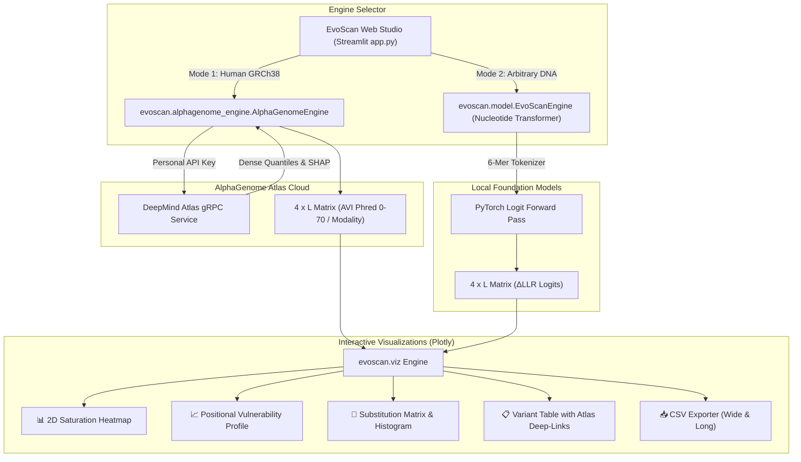

<div align="center">

# 🧬 EvoScan
### Dual-Engine DNA Saturation Mutagenesis & Deep Mutational Scanning Visualizer
**Powered by Google DeepMind AlphaGenome Atlas & Genomic Foundation Models**

[](https://opensource.org/licenses/MIT)
[](https://www.python.org/)
[](https://deepmind.google.com/science/alphagenome/atlas)
[](https://pytorch.org/)
[](https://huggingface.co/)
[](https://streamlit.io/)
[](https://plotly.com/)

*An open-source bioinformatics platform for in silico saturation mutagenesis and zero-shot variant effect prediction across human genomic loci and synthetic DNA.*

---


</div>

---

## ⚡ What's New in v1.2: Google DeepMind AlphaGenome Atlas Engine

EvoScan now features a **Dual-Engine Architecture** combining local genomic language models with Google DeepMind's newly released **AlphaGenome Atlas**:

1. **🧬 Google DeepMind AlphaGenome Atlas (Human Genomic Loci GRCh38 via Cloud gRPC):**
   - **1-Megabase Context Window:** Integrates distal enhancers, silencers, and long-range 3D chromatin conformation.
   - **9,440 Multi-Omic Tracks:** Predicts across 18 functional modalities including splicing disruption, RNA-seq expression, DNase I hypersensitivity, ATAC-seq open chromatin, ChIP-TF binding, histone modifications, and mammalian conservation.
   - **Genome-Wide Calibrated Phred Scores ($0-70$):** Non-negative $-10 \log_{10}(1 - Q)$ scaling calibrated across all ~9 billion possible single nucleotide variants in the human genome.
   - **Direct Atlas Deep-Linking:** Each variant in the interactive table features a clickable deep-link button opening the official Google DeepMind multi-omic viewer for that specific mutation.
   - **Clinical & Biological Presets:** Instant loading for *HBB* promoter (beta-thalassemia), *TP53* Exon 5 core, *BRCA1* splice donor, *CAPN3* Exon 10, *APOA1* TATA, and *BTK* SPI1 motif.

2. **🧪 Nucleotide Transformer & Biophysical Models (Custom & Synthetic Sequences):**
   - Zero-shot $\Delta\text{LLR}$ logit scoring on arbitrary DNA sequences without coordinate constraints.
   - 6-mer non-overlapping tokenization with exact tensor sub-token alignment.
   - Offline Bio-Physics heuristic fallback engine (Kimura 2-parameter + CpG islands).

---

## 📸 Interactive Visualizations & Features

### 1. 2D Deep Mutational Scanning (DMS) Heatmap
Two-dimensional interactive saturation heatmap showing either calibrated **AVI Phred scores** ($0-70$) or log-likelihood ratio impact ($\Delta\text{LLR}$) for all single-nucleotide variants across every locus. White dot markers highlight the wild-type reference sequence.

### 2. Positional Vulnerability & Hotspot Profile
Identifies critical regulatory loci and hyper-sensitive positions with combined bar charts (peak mutation impact) and trend lines (mean positional vulnerability).

### 3. Substitution Matrix & Distribution
$4 \times 4$ transition/transversion substitution matrix ($A \to C, G, T$) and distribution histogram categorized by biological impact tiers.

### 4. Interactive Variant Table & AlphaGenome Atlas Deep-Links
Searchable and filterable variant catalog with real-time classification chips, mutation lookups (e.g. `A10G`), and direct **🔗 Esplora nell'Atlas** deep-link buttons.

### 5. Open Data Export (Wide & Long CSV)
Export complete DMS matrices in both 2D wide format ($4 \times L$) and tidy long format (with genomic coordinates and Atlas URLs) for downstream pipelines in R/Bioconductor and Python.

---

## 🔬 Scoring Metrics & Mathematical Formulations

### AlphaGenome Variant Impact (AVI) Phred Score
For human genomic intervals queried via the AlphaGenome Atlas engine, each candidate variant is calibrated against the empirical genome-wide distribution:

$$\text{Phred} = -10 \log_{10}(1 - Q)$$

where $Q \in [0, 1]$ represents the genome-wide quantile score.

| AVI Phred Score | Quantile Tier | Biological Interpretation | UI Badge |
| :--- | :--- | :--- | :--- |
| $\text{Score} = 0.0$ | Baseline | **Wild-Type Reference** | 🟢 Reference |
| $\text{Score} < 5.0$ | Bottom 68% | **Tolerated / Neutral** | ⚪ Neutral |
| $5.0 \le \text{Score} < 10.0$ | Top 32% - 10% | **Mild Impact** | 🔵 Mild |
| $10.0 \le \text{Score} < 20.0$ | Top 10% - 1% | **Moderate Disruption** | 🟡 Moderate |
| $20.0 \le \text{Score} < 30.0$ | Top 1% - 0.1% | **High Disruption** | 🟠 High |
| $\text{Score} \ge 30.0$ | Top 0.1% | **Extremely Disruptive / Pathogenic** | 🔴 Extreme |

### Nucleotide Transformer Log-Likelihood Ratio ($\Delta\text{LLR}$)
For arbitrary DNA sequences scored via the local transformer engine:

$$\Delta \text{LLR}(j, m) = \log P_\mathcal{M}(x_j = m \mid \mathbf{x}_{\setminus j}) - \log P_\mathcal{M}(x_j = x_j^{\text{WT}} \mid \mathbf{x}_{\setminus j})$$

---

## 🔑 AlphaGenome API Key Configuration

To query Google DeepMind's AlphaGenome Atlas cloud service, users must provide their personal API key (free for academic research / Research Use Only).

1. **Obtain your personal API key:** [Google DeepMind AlphaGenome API Portal](https://deepmind.google.com/science/alphagenome/api).
2. **Option A (UI):** Paste your key directly in the EvoScan sidebar (masked with `••••••••`).
3. **Option B (Local `.env`):** Add `ALPHAGENOME_API_KEY="your_api_key"` to your `.env` file.
4. **Option C (Environment Variable):** Set `export ALPHAGENOME_API_KEY="your_api_key"` in your terminal.

> 📖 **Full Guide:** See [**`ALPHAGENOME_API_GUIDE.md`**](ALPHAGENOME_API_GUIDE.md) for detailed instructions, rate limits, and troubleshooting.

---

## 🏗️ Architecture Overview



---

## 🚀 Quick Start

### 1. Clone the Repository
```bash
git clone https://github.com/davide6600/EvoScan.git
cd EvoScan
```

### 2. Create and Activate Virtual Environment
```bash
python -m venv .venv

# Linux / macOS:
source .venv/bin/activate

# Windows (PowerShell):
.venv\Scripts\Activate.ps1
```

### 3. Install Dependencies
```bash
pip install -r requirements.txt
```

### 4. Run the Streamlit Application
```bash
streamlit run app.py
```
Open your browser at `http://localhost:8501`.

---

## 🧪 Automated Test Suite

EvoScan includes 22 automated unit and integration tests:

```bash
python -m pytest tests/ -v
```

Tests cover:
- DNA IUPAC validation & FASTA parsing
- Nucleotide Transformer 6-mer tensor alignment
- AlphaGenome coordinate parsing (`chr:start-end`) and clinical preset integrity
- DeepMind Atlas URL deep-link formatting
- Plotly figure generation across bidirectional $\Delta\text{LLR}$ and sequential Phred scales
- Live gRPC connectivity against Google DeepMind servers

---

## 📂 Repository Structure

```
EvoScan/
├── app.py                             # Main Streamlit web application (Dual-Engine)
├── requirements.txt                   # Python dependency specifications
├── .gitignore                         # Environment & build file exclusions
├── LICENSE                            # MIT License
├── README.md                          # Scientific & technical documentation
├── ALPHAGENOME_ATLAS_GUIDE.md         # Comprehensive AlphaGenome Atlas architectural guide
├── EVOSCAN_ALPHAGENOME_INTEGRATION.md # Integration blueprint and Pros & Cons analysis
├── ALPHAGENOME_API_GUIDE.md           # User guide for Google DeepMind API key setup
├── evoscan/                           # Core Python package
│   ├── __init__.py                    # Package entry point & exports
│   ├── alphagenome_engine.py          # Google DeepMind AlphaGenome Atlas gRPC engine
│   ├── model.py                       # Nucleotide Transformer & local scoring engine
│   ├── utils.py                       # Sequence sanitizer, bio-stats, and Phred formatting
│   └── viz.py                         # Plotly 2D heatmaps and vulnerability profiles
├── sample_data/                       # Biological presets
│   └── sequences.json                 # Curated promoter, exon, and enhancer sequences
└── tests/                             # Automated test suite (22 tests)
    ├── test_alphagenome_engine.py     # AlphaGenome engine & visualization tests
    ├── test_dna_utils.py              # DNA validation & FASTA tests
    ├── test_model_scoring.py          # Tensor shape & scoring logic tests
    └── test_visualization.py          # Plotly chart generation tests
```

---

## 📚 References & Citations

1. **Google DeepMind AlphaGenome Team** (2024). *AlphaGenome Atlas: A 1-Megabase Context Foundation Model for Human Genomics and Dense Epigenomic Variant Scoring*. [DeepMind Science](https://deepmind.google.com/science/alphagenome).
2. **Dalla-Torre, H., Gonzalez, L., Mendoza-Revilla, J., et al.** (2023). *The Nucleotide Transformer: Building and Evaluating Robust Foundation Models for Human Genomics*. **Nature Biotechnology / bioRxiv**.
3. **Fowler, D. M., & Fields, S.** (2014). *Deep mutational scanning: a new style of protein and nucleic acid science*. **Nature Methods**, 11(8), 801-807.
4. **Brandes, N., Goldman, G., Wang, C. H., et al.** (2023). *Genome-wide prediction of disease variant effects with a deep learning model*. **Science**, 381(6664).

---

## 📄 License

This project is licensed under the terms of the [MIT License](LICENSE).
